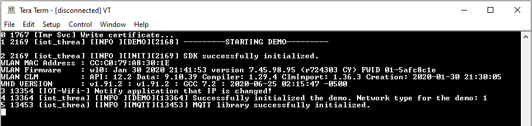
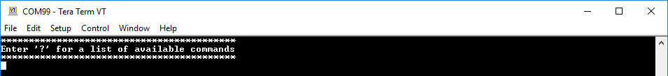
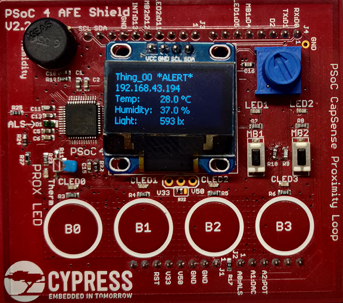

# AWS IoT and FreeRTOS for PSoC 6 MCU: Weather Station

This example demonstrates an AWS IoT Weather Station using PSoC® 6 MCU and ModusToolbox® FreeRTOS SDK. This station will connect to AWS IoT using the MQTT protocol and publish weather updates to a Thing Shadow. In addition, the station subscribes to updates from other weather stations.

[Provide feedback on this Code Example.](https://cypress.co1.qualtrics.com/jfe/form/SV_1NTns53sK2yiljn?Q_EED=eyJVbmlxdWUgRG9jIElkIjoiQ0UyMjg5MDUiLCJTcGVjIE51bWJlciI6IjAwMi0yODkwNSIsIkRvYyBUaXRsZSI6IkFXUyBJb1QgYW5kIEZyZWVSVE9TIGZvciBQU29DIDYgTUNVOiBPVEEiLCJyaWQiOiJzYmtyIiwiRG9jIHZlcnNpb24iOiIxLjAuMCIsIkRvYyBMYW5ndWFnZSI6IkVuZ2xpc2giLCJEb2MgRGl2aXNpb24iOiJNQ0QiLCJEb2MgQlUiOiJJQ1ciLCJEb2MgRmFtaWx5IjoiUFNPQyJ9)

## Requirements

- [ModusToolbox® software](https://www.cypress.com/products/modustoolbox-software-environment) v2.1

- Programming Language: C

- Associated Parts: All [PSoC® 6 MCU](http://www.cypress.com/PSoC6) parts with FreeRTOS support

Install the following additional software if you are using CMake. This code example was tested with CMake version 3.19.4 and Ninja version 1.10.2.

- [CMake](https://cmake.org/download/)

- [Ninja](https://ninja-build.org/)

## Supported Toolchains (make variable 'TOOLCHAIN')

- GNU Arm® Embedded Compiler v7.2.1 (`GCC_ARM`) - Default value of `TOOLCHAIN`

- Arm compiler v6.11 (`ARM`)

- IAR C/C++ compiler v8.42.2 (`IAR`)

## Supported Kits

- [PSoC 6 WiFi-BT Pioneer Kit](https://www.cypress.com/CY8CKIT-062-WiFi-BT) (`CY8CKIT-062-WiFi-BT`) - Default target

## Hardware Setup

This code example requires [CY8CKIT-032 PSoC Analog Front End (AFE) Arduino Shield](https://www.cypress.com/documentation/development-kitsboards/cy8ckit-032-psoc-analog-front-end-afe-arduino-shield). 

This example uses the kit’s default configuration. Refer to the kit guide to ensure the kit is configured correctly.

**Note:** The PSoC 6 WiFi-BT Pioneer Kit ship with KitProg2 installed. ModusToolbox software requires KitProg3. Before using this code example, make sure that the board is upgraded to KitProg3. The tool and instructions are available in the [Firmware Loader](https://github.com/cypresssemiconductorco/Firmware-loader) GitHub repository. If you do not upgrade, you will see an error like "unable to find CMSIS-DAP device" or "KitProg firmware is out of date".

## Software Setup

Install a terminal emulator if you don't have one. Instructions in this document use [Tera Term](https://ttssh2.osdn.jp/index.html.en).

## Using the Code Example

### First Steps:

1. Recursively clone FreeRTOS from [GitHub](https://github.com/cypresssemiconductorco/amazon-freertos).

   ```
   git clone --recurse-submodules https://github.com/cypresssemiconductorco/amazon-freertos.git --branch 202007-MTBAFR2041
   ```

2. Go to the *\<amazon-freertos>/projects/cypress* folder.

   **Note:** *\<amazon-freertos>* refers to the path of FreeRTOS in your computer.

3. Clone or download this code example, or copy it if you already have it.

   ```
   git clone --recurse-submodules https://github.com/cypresssemiconductorco/afr-example-weather-station.git
   ```
4. Open *\<amazon-freertos>/demos/include/aws_clientcredential.h* file and configure the SSID, Wi-Fi password of the desired network, and AWS parameters such as endpoint and Thing name. Each station can have a unique Thing name between *Thing_00* to *Thing_39*.

5. Configure the client certificate and the private key in *\<amazon-freertos>/demos/include/aws_clientcredential_keys.h* for the Thing used in Step 4.

6. Open the demo source file *common_resource.h* and update the value of `MY_THING` to the Thing number used in Step 4.

7. Connect the CY8CKIT-032 PSoC AFE shield to the Arduino header on the CY8CKIT_062_WIFI_BT kit.

8. Connect the base kit to your PC using the provided USB cable through the USB connector.

9. Open a terminal program and select the KitProg3 COM port. Set the serial port parameters to 8N1 and 115200 baud.

### Using Eclipse IDE for ModusToolbox:

1. Go to **File** > **Import**.

2. Choose **Existing Projects into Workspace** under **General**, and click **Next**.

3. Click the **Browse** button near **Select root directory**, choose the CE folder *\<amazon-freertos>/projects/cypress/afr-example-weather-station*, and click **Finish**.

4. Select the application project in the Project Explorer.

5. In the **Quick Panel**, scroll down, and click **afr-example-weather-station Program (KitProg3)**.

To program a target board different from the default one defined using the `TARGET` variable in the Makefile, you need to generate the launch configurations for the new target. See [Running FreeRTOS Code Examples - KBA228845](https://www.cypress.com/KBA228845) for details.

### Using Command-line Interface (CLI):

1. Open a CLI terminal and navigate to the CE folder.

2. From the terminal, execute the `make program` command to build and program the application using the default toolchain to the default target. You can specify a target and toolchain manually:

   ```
   make program TARGET=<BSP> TOOLCHAIN=<toolchain>
   ```
   Example:

   ```
   make program TARGET=CY8CKIT-062-WIFI-BT TOOLCHAIN=GCC_ARM
   ```

### Using CMake:

1. Run the following command from the code example directory (*\<amazon-freertos>/projects/cypress/afr-example-weather_station*) to configure and generate CMake build files using Ninja as the generator:

   ```
   cmake -DVENDOR=cypress -DBOARD=CY8CKIT_062_WIFI_BT -DCOMPILER=<toolchain> -S . -B build -G Ninja -DCMAKE_TOOLCHAIN_FILE=../../../tools/cmake/toolchains/<toolchain>.cmake -DAFR_TOOLCHAIN_PATH=<Path to compiler bin directory>
   ```
   Example:

   ```
   cmake -DVENDOR=cypress -DBOARD=CY8CKIT_062_WIFI_BT -DCOMPILER=arm_gcc -S . -B build -G Ninja -DCMAKE_TOOLCHAIN_FILE=../../../tools/cmake/toolchains/arm_gcc.cmake -DAFR_TOOLCHAIN_PATH=<ModusToolbox_install_dir>/tools_2.1/gcc-7.2.1/bin
   ```


2. Once CMake has generated the configuration, run the following command:

   ```
   cmake --build build
   ```

3. Use [Cypress Programmer](https://www.cypress.com/products/psoc-programming-solutions) to program the *afr-example-weather-station.elf* file generated under *\<amazon-freertos>/build/cmake_build*.

## Operation

1. After programming, the application starts automatically. On the terminal window, a message with the Wi-Fi connection details should appear:

    **Figure 1. Startup Screen**

    

2. After the connection is successful, a new command instruction appears. Go through the commands for different operations.

    **Figure 2. Command Screen**

    

3. Confirm that the OLED display is ON and showing details about Thing number, IP address, temperature, humidity, and light.

    **Figure 3. OLED Screen**

    

4. Press the touch button B1 on the AFE shield to move to the previous Thing, B2 to move to next thing, and B3 to move by 10 Things forward. Press B0 to display the page of your Thing.

5. Press the push button MB1 on the AFE shield to publish the weather alert, and confirm that the alert is displayed next to the Thing name. Press MB2 to publish the current weather details.

6. The Weather Station publishes the weather details every 30 seconds. When you have selected another Thing or Weather Station, the weather update from that station should show up in the display.

**Note:** This example is designed to utilize multiple weather stations (kits). If you are using only one kit, then the data (Temperature, Humidity, and Light) about other stations will be zero.

## Debugging

You can debug the example to step through the code. In Eclipse IDE for ModusToolbox, use the **afr-example-weather-station Debug (KitProg3)** configuration in the **Quick Panel**. See [Debugging a PSoC 6 MCU ModusToolbox Project - KBA224621](https://community.cypress.com/docs/DOC-15763) for details.

## Design and Implementation

This examples demonstrates an AWS IoT weather station. CY8CKIT-062-WIFI-BT Kit and CY8CKIT-032 AFE shield are the hardware used for this demo application.

CY8CKIT-032 AFE shield has analog sensors to read local temperature, humidity, and light. A PSoC 4 device present on the shield processes the sensors. It also has an OLED display, which displays the local weather data. PSoC 6 MCU communicates with the shield through the I2C interface, gathers the processed weather data, and displays it on the OLED screen. PSoC 6 MCU also communicates with the CYW4343W chip to connect to a Wi-Fi network and publishes the weather data to AWS cloud.

In this example, each weather station has a unique Thing on the AWS IoT Core. Things are named from 'Thing_00' to 'Thing_39'. Every station publishes its weather data to its Thing shadow. Each station also subscribes to the shadow updates of every other station. This way any update from one station will reflect in all other stations.

### Threads and Their Operations

Thread | Operation
-------|------------
CapSense® Thread| Reads CapSense button states from the shield every 100 ms, and then gives a semaphore to the Display thread to update the contents on the OLED screen depending on the button pressed.
Weather Data Thread| Reads the weather sensor data from the shield every 500 ms, and then gives a semaphore to the Display thread to update contents on the OLED screen.
Display Thread| Updates the contents of the Thing on the OLED display using emWin library depending on semaphores received from other threads.
Publish Thread| Publishes the weather data to the Thing Shadow every 30 s. Publishing is also done when there is an alert or when the user decides to publish the data immediately.
Command Thread| Reads the command from the UART terminal to perform different operations.

Table 1 lists the ModusToolbox resources used in this example, and how they are used in the design.

### Resources and Settings

**Table 1. Application Resources**

| Resource  |  Alias/Object     |    Purpose     |
| :------- | :------------    | :------------ |
| SCB (I2C) |   afe_shield_i2c_obj     |  Driver to communicate with shield |
| SCB (UART)|  cy_retarget_io_uart_obj |  Debug UART     |
|   GPIO    |     MECH_BTN1            |  Alert button   |
|   GPIO    |     MECH_BTN2            |  Publish button |

## Related Resources

| Application Notes                                            |                                                              |
| :----------------------------------------------------------- | :----------------------------------------------------------- |
| [AN228571](https://www.cypress.com/AN228571) – Getting Started with PSoC 6 MCU on ModusToolbox | Describes PSoC 6 MCU devices and how to build your first application with ModusToolbox |
| [AN221774](https://www.cypress.com/AN221774) – Getting Started with PSoC 6 MCU on PSoC Creator | Describes PSoC 6 MCU devices and how to build your first application with PSoC Creator |
| [AN210781](https://www.cypress.com/AN210781) – Getting Started with PSoC 6 MCU with Bluetooth Low Energy (BLE) Connectivity on PSoC Creator | Describes PSoC 6 MCU with BLE Connectivity devices and how to build your first application with PSoC Creator |
| [AN215656](https://www.cypress.com/AN215656) – PSoC 6 MCU: Dual-CPU System Design | Describes the dual-CPU architecture in PSoC 6 MCU, and shows how to build a simple dual-CPU design |
| **Code Examples**                                            |                                                              |
| [Using ModusToolbox](https://github.com/cypresssemiconductorco/Code-Examples-for-ModusToolbox-Software) | [Using PSoC Creator](https://www.cypress.com/documentation/code-examples/psoc-6-mcu-code-examples) |
| **Device Documentation**                                     |                                                              |
| [PSoC 6 MCU Datasheets](https://www.cypress.com/search/all?f[0]=meta_type%3Atechnical_documents&f[1]=resource_meta_type%3A575&f[2]=field_related_products%3A114026) | [PSoC 6 Technical Reference Manuals](https://www.cypress.com/search/all/PSoC%206%20Technical%20Reference%20Manual?f[0]=meta_type%3Atechnical_documents&f[1]=resource_meta_type%3A583) |
| **Development Kits**                                         | Buy at www.cypress.com                                       |
| [CY8CKIT-062-BLE](https://www.cypress.com/CY8CKIT-062-BLE) PSoC 6 BLE Pioneer Kit | [CY8CKIT-062-WiFi-BT](https://www.cypress.com/CY8CKIT-062-WiFi-BT) PSoC 6 WiFi-BT Pioneer Kit |
| [CY8CPROTO-063-BLE](https://www.cypress.com/CY8CPROTO-063-BLE) PSoC 6 BLE Prototyping Kit | [CY8CPROTO-062-4343W](https://www.cypress.com/CY8CPROTO-062-4343W) PSoC 6 Wi-Fi BT Prototyping Kit |
| [CY8CKIT-062S2-43012](https://www.cypress.com/CY8CKIT-062S2-43012) PSoC 62S2 Wi-Fi BT Pioneer Kit | [CY8CPROTO-062S3-4343W](https://www.cypress.com/CY8CPROTO-062S3-4343W) PSoC 62S3 Wi-Fi BT Prototyping Kit |
| [CYW9P62S1-43438EVB-01](https://www.cypress.com/CYW9P62S1-43438EVB-01) PSoC 62S1 Wi-Fi BT Pioneer Kit | [CYW9P62S1-43012EVB-01](https://www.cypress.com/CYW9P62S1-43012EVB-01) PSoC 62S1 Wi-Fi BT Pioneer Kit |                                                              |
| **Libraries**                                                 |                                                              |
| PSoC 6 Peripheral Driver Library (PDL) and docs                    | [psoc6pdl](https://github.com/cypresssemiconductorco/psoc6pdl) on GitHub |
| Cypress Hardware Abstraction Layer (HAL) Library and docs          | [psoc6hal](https://github.com/cypresssemiconductorco/psoc6hal) on GitHub |
| RetargetIO - A utility library to retarget the standard input/output (STDIO) messages to a UART port | [retarget-io](https://github.com/cypresssemiconductorco/retarget-io) on GitHub |
| **Middleware**                                               |                                                              |
| CapSense library and docs                                    | [capsense](https://github.com/cypresssemiconductorco/capsense) on GitHub |
| EmWin | [emwin](https://github.com/cypresssemiconductorco/emwin) on Github |
| Links to all PSoC 6 MCU Middleware                           | [psoc6-middleware](https://github.com/cypresssemiconductorco/psoc6-middleware) on GitHub |
| **Tools**                                                    |                                                              |
| [Eclipse IDE for ModusToolbox](https://www.cypress.com/modustoolbox)     | The cross-platform, Eclipse-based IDE for IoT designers that supports application configuration and development targeting converged MCU and wireless systems.             |
| [PSoC Creator](https://www.cypress.com/products/psoc-creator-integrated-design-environment-ide) | The Cypress IDE for PSoC and FM0+ MCU development.            |

## Other Resources

Cypress provides a wealth of data at www.cypress.com to help you select the right device, and quickly and effectively integrate it into your design.

For PSoC 6 MCU devices, see [How to Design with PSoC 6 MCU - KBA223067](https://community.cypress.com/docs/DOC-14644) in the Cypress community.

## Document History

Document Title: *CE228924* - *AWS IoT and FreeRTOS for PSoC 6 MCU: Weather Station*

| Version | Description of Change                                        |
| ------- | ------------------------------------------------------------ |
| 1.0.0   | New code example.<br>Tested with Amazon FreeRTOS release 201910.00 and emWin release 5.48.1 |
| 2.0.0   | Updated to support Amazon FreeRTOS release 202007 |

------
All other trademarks or registered trademarks referenced herein are the property of their respective owners.


-------------------------------------------------------------------------------

© Cypress Semiconductor Corporation (An Infineon Technologies Company), 2020-2021. This document is the property of Cypress Semiconductor Corporation and its subsidiaries ("Cypress"). This document, including any software or firmware included or referenced in this document ("Software"), is owned by Cypress under the intellectual property laws and treaties of the United States and other countries worldwide. Cypress reserves all rights under such laws and treaties and does not, except as specifically stated in this paragraph, grant any license under its patents, copyrights, trademarks, or other intellectual property rights. If the Software is not accompanied by a license agreement and you do not otherwise have a written agreement with Cypress governing the use of the Software, then Cypress hereby grants you a personal, non-exclusive, nontransferable license (without the right to sublicense) (1) under its copyright rights in the Software (a) for Software provided in source code form, to modify and reproduce the Software solely for use with Cypress hardware products, only internally within your organization, and (b) to distribute the Software in binary code form externally to end users (either directly or indirectly through resellers and distributors), solely for use on Cypress hardware product units, and (2) under those claims of Cypress's patents that are infringed by the Software (as provided by Cypress, unmodified) to make, use, distribute, and import the Software solely for use with Cypress hardware products. Any other use, reproduction, modification, translation, or compilation of the Software is prohibited.<br />
TO THE EXTENT PERMITTED BY APPLICABLE LAW, CYPRESS MAKES NO WARRANTY OF ANY KIND, EXPRESS OR IMPLIED, WITH REGARD TO THIS DOCUMENT OR ANY SOFTWARE OR ACCOMPANYING HARDWARE, INCLUDING, BUT NOT LIMITED TO, THE IMPLIED WARRANTIES OF MERCHANTABILITY AND FITNESS FOR A PARTICULAR PURPOSE. No computing device can be absolutely secure. Therefore, despite security measures implemented in Cypress hardware or software products, Cypress shall have no liability arising out of any security breach, such as unauthorized access to or use of a Cypress product. CYPRESS DOES NOT REPRESENT, WARRANT, OR GUARANTEE THAT CYPRESS PRODUCTS, OR SYSTEMS CREATED USING CYPRESS PRODUCTS, WILL BE FREE FROM CORRUPTION, ATTACK, VIRUSES, INTERFERENCE, HACKING, DATA LOSS OR THEFT, OR OTHER SECURITY INTRUSION (collectively, "Security Breach"). Cypress disclaims any liability relating to any Security Breach, and you shall and hereby do release Cypress from any claim, damage, or other liability arising from any Security Breach. In addition, the products described in these materials may contain design defects or errors known as errata which may cause the product to deviate from published specifications. To the extent permitted by applicable law, Cypress reserves the right to make changes to this document without further notice. Cypress does not assume any liability arising out of the application or use of any product or circuit described in this document. Any information provided in this document, including any sample design information or programming code, is provided only for reference purposes. It is the responsibility of the user of this document to properly design, program, and test the functionality and safety of any application made of this information and any resulting product. "High-Risk Device" means any device or system whose failure could cause personal injury, death, or property damage. Examples of High-Risk Devices are weapons, nuclear installations, surgical implants, and other medical devices. "Critical Component" means any component of a High-Risk Device whose failure to perform can be reasonably expected to cause, directly or indirectly, the failure of the High-Risk Device, or to affect its safety or effectiveness. Cypress is not liable, in whole or in part, and you shall and hereby do release Cypress from any claim, damage, or other liability arising from any use of a Cypress product as a Critical Component in a High-Risk Device. You shall indemnify and hold Cypress, its directors, officers, employees, agents, affiliates, distributors, and assigns harmless from and against all claims, costs, damages, and expenses, arising out of any claim, including claims for product liability, personal injury or death, or property damage arising from any use of a Cypress product as a Critical Component in a High-Risk Device. Cypress products are not intended or authorized for use as a Critical Component in any High-Risk Device except to the limited extent that (i) Cypress's published data sheet for the product explicitly states Cypress has qualified the product for use in a specific High-Risk Device, or (ii) Cypress has given you advance written authorization to use the product as a Critical Component in the specific High-Risk Device and you have signed a separate indemnification agreement.<br />
Cypress, the Cypress logo, Spansion, the Spansion logo, and combinations thereof, WICED, PSoC, CapSense, EZ-USB, F-RAM, and Traveo are trademarks or registered trademarks of Cypress in the United States and other countries. For a more complete list of Cypress trademarks, visit cypress.com. Other names and brands may be claimed as property of their respective owners.
